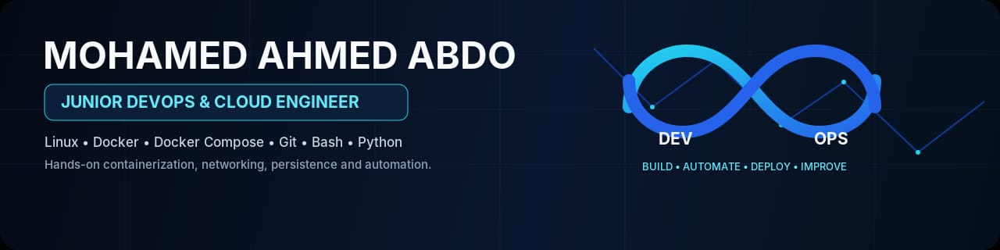

<div align="center">


<br/>

<a href="https://github.com/mhmdhmdbdh2050"></a>
<a href="https://www.linkedin.com/in/mohamed-ahmed-6705b3303/"></a>
<a href="mailto:ahmedmohamed05147@gmail.com"></a>

<br/><br/>

`Linux` · `Docker` · `Docker Compose` · `Git` · `Bash` · `Python`

</div>

---

## `> whoami`

I'm **Mohamed Ahmed Abdo**, a **Junior DevOps & Cloud Engineer** focused on learning through hands-on projects.

My current portfolio is centered on **Linux, Docker, Docker Compose, container networking, persistent storage, reverse proxies, databases, caching, Bash automation, and Git/GitHub workflows**.

I prefer building complete, working environments and documenting how the services communicate, start, persist data, and recover.

---

## `> cat ./skills`

### 🐧 Linux & Automation
`Linux` · `Ubuntu` · `Bash` · `Python`

### 🐳 Containers
`Docker` · `Docker Compose` · `Dockerfile` · `Volumes` · `Networks`

### 🌐 Networking & Services
`Docker Bridge Networks` · `TCP/IP` · `HTTP/HTTPS` · `DNS` · `SSH` · `Nginx`

### 🗄️ Data & Application Services
`PostgreSQL` · `MariaDB` · `Redis` · `WordPress` · `phpMyAdmin`

### ☁️ Cloud
`AWS Cloud Fundamentals`

> **Note:** The technologies above are presented as skills / learning areas. The portfolio only claims hands-on implementation where it is demonstrated by the repositories below.

---

# `> ls ./projects`

<table>
<tr>
<td width="50%" valign="top">

## 🥇 DevOps Automation Stack

A production-inspired learning project that connects a Flask backend with PostgreSQL, Redis and Nginx through Docker Compose.

**Demonstrates**

- Docker Compose orchestration
- Flask application container
- PostgreSQL 16
- Redis 7 Alpine
- Nginx reverse proxy
- Dedicated Docker bridge network
- Persistent PostgreSQL volume
- Health checks
- Service dependencies
- `.env.example` configuration
- Database initialization
- Backup / restore scripts
- Health-check script
- Makefile automation

**Repository:**  
[View Project →](https://github.com/mhmdhmdbdh2050/devops-automation-stack)

</td>

<td width="50%" valign="top">

## 🥈 Dockerized WordPress Stack

A multi-container WordPress deployment built with Docker Compose.

**Demonstrates**

- WordPress containerization
- MariaDB
- Nginx
- phpMyAdmin
- Docker networking
- Persistent storage
- Compose-based deployment

**Repository:**  
[View Project →](https://github.com/mhmdhmdbdh2050/docker-compose-wordpress-stack)

</td>
</tr>

<tr>
<td width="50%" valign="top">

## 🥉 Docker Networking Lab

A focused hands-on project for understanding Docker network communication and isolation.

**Focus**

- Custom bridge networks
- Container communication
- Network isolation
- Static IP addressing
- Multi-network containers

**Repository:**  
[View Project →](https://github.com/mhmdhmdbdh2050/Docker-networking-lab)

</td>

<td width="50%" valign="top">

## 📦 Docker Custom Image Project

A hands-on Docker project demonstrating how to build a custom Nginx image and serve custom web content.

**Focus**

- Dockerfile
- Image building
- Alpine Linux
- Nginx
- Port mapping
- Container lifecycle

**Repository:**  
[View Project →](https://github.com/mhmdhmdbdh2050/Docker-custom-image-project)

</td>
</tr>

<tr>
<td width="50%" valign="top">

## 💾 Docker Volume Project

A practical project focused on Docker persistent storage and volume concepts.

**Repository:**  
[View Project →](https://github.com/mhmdhmdbdh2050/Docker-volume-project)

</td>

<td width="50%" valign="top">

## 🐳 Simple Docker Project

A simple containerized HTML website used to practice Docker deployment fundamentals.

**Repository:**  
[View Project →](https://github.com/mhmdhmdbdh2050/Simple_docker_project)

</td>
</tr>
</table>

---

# `> architecture ./devops-automation-stack`


```text
Client
  │
  ▼
Nginx :80
  │
  ▼
Flask :5000
  ├──────────────► PostgreSQL :5432
  │                  └── db_data volume
  │
  └──────────────► Redis :6379
```

The repository documents health checks, startup dependencies, Docker service discovery, persistence, backup/restore, and operational scripts.

---

# `> cat ./experience.log`

This section is intentionally limited to information that has been verified for this profile.

**Current focus:** hands-on DevOps learning through the projects listed above.

---

# `> cat ./education.log`

**Cairo University — Faculty of Commerce**  
**Graduated: 2026**

---

# `> cat ./certifications.txt`

Certifications can be added here after their details are verified.

---

# `> git status`

```text
Portfolio focus:
  + Linux
  + Docker
  + Docker Compose
  + Docker Networking
  + Persistent Storage
  + Nginx
  + PostgreSQL
  + Redis
  + Bash / Python
  + Git & GitHub
  + AWS Cloud Fundamentals

No unsupported production claims.
No copied experience or certifications.
```

---

# `> ./connect.sh`

<div align="center">

**Open to Junior DevOps / Cloud opportunities and technical conversations.**

<a href="mailto:ahmedmohamed05147@gmail.com">
  
</a>
<a href="https://www.linkedin.com/in/mohamed-ahmed-6705b3303/">
  
</a>
<a href="https://github.com/mhmdhmdbdh2050">
  
</a>

<br/><br/>

`Build → Learn → Automate → Improve`

</div>
